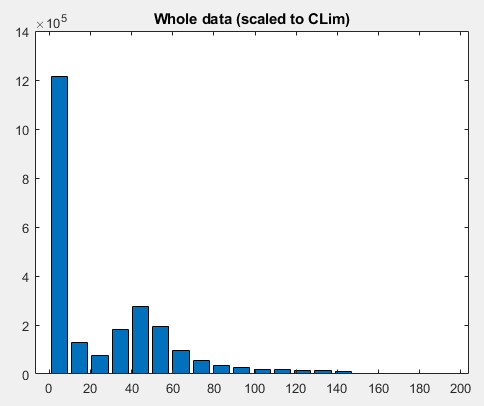

# Aedes Full Documentation (Under construction)

Menu bar
1. [File](#file)
2. [Edit](#edit)
3. [View](#view)
4. [Tools](#tools)
5. [Overlay](#overlay)
6. [ROI](#roi)
7. [Plugins](#plugins)
8. [Help](#help)

Toolbar
1. TODO
2. TODO
3. TODO...

## File
#### New window
It opens a new Aedes window.

#### Open File
It opens one of the several supported files in the current window. Supported file types: Varian or Bruker FID-files (**fid**), Bruker reconstructed files (**2dseq**), NIfTI and Analyze 7.5 files (**.nii**, **.nii.gz**, **.hdr**), S.M.I.S. Image files (**.sur**), MRI files (**.mri**), DICON image files (**.dcm**), SPECT/CT Header files (**.hdr**), Reconstruction parameter files (**.xxm**), Matlab MAT files (**.mat**), Aedes ROI files (**.roi**), Varian FDF files (**.fdf**), SWIFT reconstruction files (**.sgl**), **.t1r**, **.s1r**, **.t2r**, **.s2r**, **.t1**, **.t2**, **.s1**, **.s2**, **.df**, **.sf**, **.r2**, **.b1**.

#### Open Multiple Files
???

#### Open Recent
It allows you to open one of the files opened recently.

#### Save Image Data as
It saves the current 3D image as a NIfTI file (**.nii**), Analyze 7.5 (**.hdr**), Matlab MAT file (**.mat**) or MRI file (**.mri**)

#### Save result as
Save ROi as ROI (**.roi**) or Statistics (**.res**). If there is no ROI it will raise an error.

#### Export Image Data
It generates image/s (**.jpg**, **.tiff**, **.png**, **.bmp** and **.eps**) of the currently opened 3D image.

#### Close file
It will close the currently opened image.

#### Exit Aedes
It exists Aedes.

## Edit
TODO

## View
TODO

## Tools
TODO

## Overlay
TODO

## ROI
TODO

## Plugins
* [fmri plugins](#fmri-plugins)
  * [Correlation mapping](#correlation-mapping)
  * [Fmri analysis](#fmri-analysis)
  * [Motion estimate](#motion-estimate)
  * [Network analysis](#network-analysis)
  * [Old fmri analysis](#old-fmri-analysis)
  * [Resting state fc](#resting-state-fc)
  * [Roi averages](#roi-averages)
* [map plugins](#map-plugins)
  * [T1 3 parameter fit](#t1-3-parameter-fit)
  * [T1 inversion recovery](#t1-inversion-recovery)
  * [T1 rho](#t1-rho)
  * [T1 saturation recovery](#t1-saturation-recovery)
  * [T2](#t2)
  * [T2 rho](#t2-rho)
* [Brain masking](#brain-masking)
* [Calc asl cbf](#calc-asl-cbf)
* [Copy data to workspace](#copy-data-to-workspace)
* [Fat analysis](#fat-analysis)
* [Histograms](#histograms)
* [Open in imtool](#open-in-imtool)
* [Plot profile](#plot-profile)
* [Save overlay as roi](#save-overlay-as-roi)
* [Take snapshop](#take-snapshop)
* [View kspace](#view-kspace)
* [Write difference image](#write-difference-image)

#### Brain masking
It generates a brain mask by thresholding the currently opened brain.

Usage: Open Aedes -> Open File -> Plugins -> Brain masking.

#### Copy data to workspace
It copies the loaded DATA and ROIs to Matlab's workspace to work directly from the command line.

#### Histograms
It shows the histogram of values of the opened file.

#### Open in imtool
It will open the current slice in imtool, a Matlab environment to visualize and perform common image processing tasks.

#### Plot profile
It plots the intensities of the pixels along the lines drawn in the current slice.

#### Save roi as mask
It saves the first selected ROI as a mask (NIfTI binary file). Note that it cannot save more than one ROI at the same time.

Usage: Open Aedes -> Open File -> Draw a ROI or Load a ROI -> Select ROI we want to save -> Plugins -> Save roi as mask.

#### Take snapshot
It takes a snapshot from Aede's workspace capturing the 3 views.

## Help
TODO
